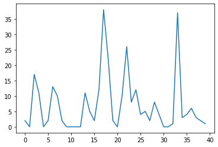
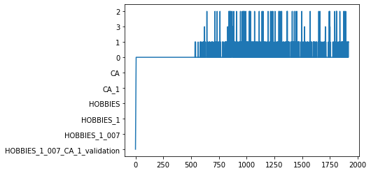
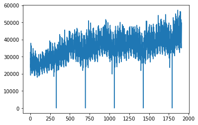
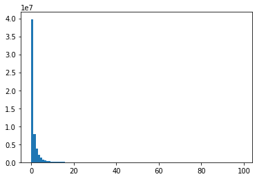

项目背景请看这里：https://www.kaggle.com/c/m5-forecasting-accuracy

---
## 数据分析

参考 [EDA](https://www.kaggle.com/headsortails/back-to-predict-the-future-interactive-m5-eda)


```python
from matplotlib import pyplot as plt
import pandas as pd
import numpy as np
pd.set_option('display.max_colwidth',100)
```


```python
sale_data = pd.read_csv('./m5-forecasting-accuracy/sales_train_validation.csv')
```


```python
sale_data.shape
```


    (30490, 1919)


```python
plt.plot(list(sale_data.iloc[7,:][6:])[-8*5:])
```


    [<matplotlib.lines.Line2D at 0x1e2dbe36148>]





```python
plt.plot(list(sale_data.iloc[6,:]))
```


    [<matplotlib.lines.Line2D at 0x1e2dbbb9bc8>]





```python
day_data = sale_data[[f'd_{day}' for day in range(1,1914)]]
total_sum = np.sum(day_data,axis=0).values
```


```python
total_sum
```


    array([32631, 31749, 23783, ..., 40517, 48962, 49795], dtype=int64)


```python
plt.plot(total_sum)
```


    [<matplotlib.lines.Line2D at 0x1e2dc0fbe08>]





```python
2000/365
```


    5.47945205479452


```python
price_data = pd.read_csv('./m5-forecasting-accuracy/sell_prices.csv')
# 加载cal数据
cal_data = pd.read_csv('./m5-forecasting-accuracy/calendar.csv')
```


```python
price_data.head(1)
```
</style>
<table border="1" class="dataframe">
  <thead>
    <tr style="text-align: right;">
      <th></th>
      <th>store_id</th>
      <th>item_id</th>
      <th>wm_yr_wk</th>
      <th>sell_price</th>
    </tr>
  </thead>
  <tbody>
    <tr>
      <td>0</td>
      <td>CA_1</td>
      <td>HOBBIES_1_001</td>
      <td>11325</td>
      <td>9.58</td>
    </tr>
  </tbody>
</table>
</div>
```python
sale_data.iloc[1,:]
```

    id          HOBBIES_1_002_CA_1_validation
    item_id                     HOBBIES_1_002
    dept_id                         HOBBIES_1
    cat_id                            HOBBIES
    store_id                             CA_1
                            ...              
    d_1909                                  1
    d_1910                                  0
    d_1911                                  0
    d_1912                                  0
    d_1913                                  0
    Name: 1, Length: 1919, dtype: object


```python
sale_data.head(1)
```

</style>
<table border="1" class="dataframe">
  <thead>
    <tr style="text-align: right;">
      <th></th>
      <th>id</th>
      <th>item_id</th>
      <th>dept_id</th>
      <th>cat_id</th>
      <th>store_id</th>
      <th>state_id</th>
      <th>d_1</th>
      <th>d_2</th>
      <th>d_3</th>
      <th>d_4</th>
      <th>...</th>
      <th>d_1904</th>
      <th>d_1905</th>
      <th>d_1906</th>
      <th>d_1907</th>
      <th>d_1908</th>
      <th>d_1909</th>
      <th>d_1910</th>
      <th>d_1911</th>
      <th>d_1912</th>
      <th>d_1913</th>
    </tr>
  </thead>
  <tbody>
    <tr>
      <td>0</td>
      <td>HOBBIES_1_001_CA_1_validation</td>
      <td>HOBBIES_1_001</td>
      <td>HOBBIES_1</td>
      <td>HOBBIES</td>
      <td>CA_1</td>
      <td>CA</td>
      <td>0</td>
      <td>0</td>
      <td>0</td>
      <td>0</td>
      <td>...</td>
      <td>1</td>
      <td>3</td>
      <td>0</td>
      <td>1</td>
      <td>1</td>
      <td>1</td>
      <td>3</td>
      <td>0</td>
      <td>1</td>
      <td>1</td>
    </tr>
  </tbody>
</table>
<p>1 rows × 1919 columns</p>
</div>


```python
cal_data.head(1)
```


<div>
<style scoped>
    .dataframe tbody tr th:only-of-type {
        vertical-align: middle;
    }

</style>
<table border="1" class="dataframe">
  <thead>
    <tr style="text-align: right;">
      <th></th>
      <th>date</th>
      <th>wm_yr_wk</th>
      <th>weekday</th>
      <th>wday</th>
      <th>month</th>
      <th>year</th>
      <th>d</th>
      <th>event_name_1</th>
      <th>event_type_1</th>
      <th>event_name_2</th>
      <th>event_type_2</th>
      <th>snap_CA</th>
      <th>snap_TX</th>
      <th>snap_WI</th>
    </tr>
  </thead>
  <tbody>
    <tr>
      <td>0</td>
      <td>2011-01-29</td>
      <td>11101</td>
      <td>Saturday</td>
      <td>1</td>
      <td>1</td>
      <td>2011</td>
      <td>d_1</td>
      <td>NaN</td>
      <td>NaN</td>
      <td>NaN</td>
      <td>NaN</td>
      <td>0</td>
      <td>0</td>
      <td>0</td>
    </tr>
  </tbody>
</table>
</div>


```python
plt.hist(day_data[day_data<100].values.reshape(-1),bins=100);
```

    C:\Users\12854\Anaconda3\lib\site-packages\numpy\lib\histograms.py:824: RuntimeWarning: invalid value encountered in greater_equal
      keep = (tmp_a >= first_edge)
    C:\Users\12854\Anaconda3\lib\site-packages\numpy\lib\histograms.py:825: RuntimeWarning: invalid value encountered in less_equal
      keep &= (tmp_a <= last_edge)




---
## 特征工程

抽取窗口特征：

- 前7天
- 前28天
- 前7天均值
- 前28天均值

关联其他维度信息

- 日期
- 价格


```python
import sys
import lightgbm as lgb
from  datetime import datetime, timedelta
```


```python
def create_train_data(train_start=750,test_start=1800,is_train=True):
    # 基本参数
    PRICE_DTYPES = {"store_id": "category", "item_id": "category", "wm_yr_wk": "int16","sell_price":"float32" }
    CAL_DTYPES={"event_name_1": "category", "event_name_2": "category", "event_type_1": "category", 
            "event_type_2": "category", "weekday": "category", 'wm_yr_wk': 'int16', "wday": "int16",
            "month": "int16", "year": "int16", "snap_CA": "float32", 'snap_TX': 'float32', 'snap_WI': 'float32' }

    start_day = train_start if is_train else test_start
    numcols = [f"d_{day}" for day in range(start_day,1914)]
    catcols = ['id', 'item_id', 'dept_id','store_id', 'cat_id', 'state_id']
    SALE_DTYPES = {numcol:"float32" for numcol in numcols} 
    SALE_DTYPES.update({col: "category" for col in catcols if col != "id"})

    # 加载price数据
    price_data = pd.read_csv('./m5-forecasting-accuracy/sell_prices.csv',dtype=PRICE_DTYPES)
    # 加载cal数据
    cal_data = pd.read_csv('./m5-forecasting-accuracy/calendar.csv',dtype=CAL_DTYPES)
    # 加载sale数据
    sale_data = pd.read_csv('./m5-forecasting-accuracy/sales_train_validation.csv',dtype=SALE_DTYPES,usecols=catcols+numcols)


    # 类别标签转换
    for col, col_dtype in PRICE_DTYPES.items():
        if col_dtype == "category":
            price_data[col] = price_data[col].cat.codes.astype("int16")
            price_data[col] -= price_data[col].min()

    cal_data["date"] = pd.to_datetime(cal_data["date"])
    for col, col_dtype in CAL_DTYPES.items():
        if col_dtype == "category":
            cal_data[col] = cal_data[col].cat.codes.astype("int16")
            cal_data[col] -= cal_data[col].min()


    for col in catcols:
        if col != "id":
            sale_data[col] = sale_data[col].cat.codes.astype("int16")
            sale_data[col] -= sale_data[col].min()

    # 注意提交格式里有一部分为空
    if not is_train:
        for day in range(1913+1, 1913+ 2*28 +1):
            sale_data[f"d_{day}"] = np.nan

    sale_data = pd.melt(sale_data,
            id_vars = catcols,
            value_vars = [col for col in sale_data.columns if col.startswith("d_")],
            var_name = "d",
            value_name = "sales")
    sale_data = sale_data.merge(cal_data, on= "d", copy = False)
    sale_data = sale_data.merge(price_data, on = ["store_id", "item_id", "wm_yr_wk"], copy = False)
    return sale_data


def create_feature(sale_data, is_train=True, day=None):
    
    # 获取7天前的数据，28天前的数据
    lags = [7, 28]
    lag_cols = [f"lag_{lag}" for lag in lags ]

    # 如果是测试集只需要计算一天的特征，减少计算量
    # 注意训练集和测试集特征生成要一致
    if is_train:
        for lag, lag_col in zip(lags, lag_cols):
            sale_data[lag_col] = sale_data[["id","sales"]].groupby("id")["sales"].shift(lag)
    else:
        for lag, lag_col in zip(lags, lag_cols):
            sale_data.loc[sale_data.date == day, lag_col] = sale_data.loc[sale_data.date ==day-timedelta(days=lag), 'sales'].values  


    # 将获取7天前的数据，28天前的数据做移动平均
    wins = [7, 28] 

    if is_train:
        for win in wins :
            for lag,lag_col in zip(lags, lag_cols):
                sale_data[f"rmean_{lag}_{win}"] = sale_data[["id", lag_col]].groupby("id")[lag_col].transform(lambda x : x.rolling(win).mean())
    else:
        for win in wins:
            for lag in lags:
                df_window = sale_data[(sale_data.date <= day-timedelta(days=lag)) & (sale_data.date > day-timedelta(days=lag+win))]
                df_window_grouped = df_window.groupby("id").agg({'sales':'mean'}).reindex(sale_data.loc[sale_data.date==day,'id'])
                sale_data.loc[sale_data.date == day,f"rmean_{lag}_{win}"] = df_window_grouped.sales.values

    # 处理时间特征
    # 有的时间特征没有，通过datetime的方法自动生成
    date_features = {
            "wday": "weekday",
            "week": "weekofyear",
            "month": "month",
            "quarter": "quarter",
            "year": "year",
            "mday": "day",
        }

    for date_feat_name, date_feat_func in date_features.items():
        if date_feat_name in sale_data.columns:
            sale_data[date_feat_name] = sale_data[date_feat_name].astype("int16")
        else:
            sale_data[date_feat_name] = getattr(sale_data["date"].dt, date_feat_func).astype("int16")
    return sale_data
```

```python
sale_data = create_train_data(train_start=350,is_train=True)
sale_data = create_feature(sale_data)
```

```python
pd.options.display.max_columns = 33
```


```python
sale_data.shape
```

    (40718219, 31)

```python
sale_data[sale_data.event_name_1 != 0]
```


<div>
<style scoped>
    .dataframe tbody tr th:only-of-type {
        vertical-align: middle;
    }

</style>
<table border="1" class="dataframe">
  <thead>
    <tr style="text-align: right;">
      <th></th>
      <th>id</th>
      <th>item_id</th>
      <th>dept_id</th>
      <th>store_id</th>
      <th>cat_id</th>
      <th>state_id</th>
      <th>d</th>
      <th>sales</th>
      <th>date</th>
      <th>wm_yr_wk</th>
      <th>weekday</th>
      <th>wday</th>
      <th>month</th>
      <th>year</th>
      <th>event_name_1</th>
      <th>event_type_1</th>
      <th>event_name_2</th>
      <th>event_type_2</th>
      <th>snap_CA</th>
      <th>snap_TX</th>
      <th>snap_WI</th>
      <th>sell_price</th>
      <th>lag_7</th>
      <th>lag_28</th>
      <th>rmean_7_7</th>
      <th>rmean_28_7</th>
      <th>rmean_7_28</th>
      <th>rmean_28_28</th>
      <th>week</th>
      <th>quarter</th>
      <th>mday</th>
    </tr>
  </thead>
  <tbody>
    <tr>
      <td>16858</td>
      <td>HOBBIES_1_002_CA_1_validation</td>
      <td>1</td>
      <td>0</td>
      <td>0</td>
      <td>0</td>
      <td>0</td>
      <td>d_353</td>
      <td>0.0</td>
      <td>2012-01-16</td>
      <td>11151</td>
      <td>1</td>
      <td>3</td>
      <td>1</td>
      <td>2012</td>
      <td>14</td>
      <td>2</td>
      <td>0</td>
      <td>0</td>
      <td>0.0</td>
      <td>0.0</td>
      <td>0.0</td>
      <td>3.97</td>
      <td>NaN</td>
      <td>NaN</td>
      <td>NaN</td>
      <td>NaN</td>
      <td>NaN</td>
      <td>NaN</td>
      <td>3</td>
      <td>1</td>
      <td>16</td>
    </tr>
    <tr>
      <td>16865</td>
      <td>HOBBIES_1_004_CA_1_validation</td>
      <td>3</td>
      <td>0</td>
      <td>0</td>
      <td>0</td>
      <td>0</td>
      <td>d_353</td>
      <td>4.0</td>
      <td>2012-01-16</td>
      <td>11151</td>
      <td>1</td>
      <td>3</td>
      <td>1</td>
      <td>2012</td>
      <td>14</td>
      <td>2</td>
      <td>0</td>
      <td>0</td>
      <td>0.0</td>
      <td>0.0</td>
      <td>0.0</td>
      <td>4.34</td>
      <td>NaN</td>
      <td>NaN</td>
      <td>NaN</td>
      <td>NaN</td>
      <td>NaN</td>
      <td>NaN</td>
      <td>3</td>
      <td>1</td>
      <td>16</td>
    </tr>
    <tr>
      <td>16872</td>
      <td>HOBBIES_1_005_CA_1_validation</td>
      <td>4</td>
      <td>0</td>
      <td>0</td>
      <td>0</td>
      <td>0</td>
      <td>d_353</td>
      <td>2.0</td>
      <td>2012-01-16</td>
      <td>11151</td>
      <td>1</td>
      <td>3</td>
      <td>1</td>
      <td>2012</td>
      <td>14</td>
      <td>2</td>
      <td>0</td>
      <td>0</td>
      <td>0.0</td>
      <td>0.0</td>
      <td>0.0</td>
      <td>2.48</td>
      <td>NaN</td>
      <td>NaN</td>
      <td>NaN</td>
      <td>NaN</td>
      <td>NaN</td>
      <td>NaN</td>
      <td>3</td>
      <td>1</td>
      <td>16</td>
    </tr>
    <tr>
      <td>16879</td>
      <td>HOBBIES_1_008_CA_1_validation</td>
      <td>7</td>
      <td>0</td>
      <td>0</td>
      <td>0</td>
      <td>0</td>
      <td>d_353</td>
      <td>2.0</td>
      <td>2012-01-16</td>
      <td>11151</td>
      <td>1</td>
      <td>3</td>
      <td>1</td>
      <td>2012</td>
      <td>14</td>
      <td>2</td>
      <td>0</td>
      <td>0</td>
      <td>0.0</td>
      <td>0.0</td>
      <td>0.0</td>
      <td>0.50</td>
      <td>NaN</td>
      <td>NaN</td>
      <td>NaN</td>
      <td>NaN</td>
      <td>NaN</td>
      <td>NaN</td>
      <td>3</td>
      <td>1</td>
      <td>16</td>
    </tr>
    <tr>
      <td>16886</td>
      <td>HOBBIES_1_009_CA_1_validation</td>
      <td>8</td>
      <td>0</td>
      <td>0</td>
      <td>0</td>
      <td>0</td>
      <td>d_353</td>
      <td>1.0</td>
      <td>2012-01-16</td>
      <td>11151</td>
      <td>1</td>
      <td>3</td>
      <td>1</td>
      <td>2012</td>
      <td>14</td>
      <td>2</td>
      <td>0</td>
      <td>0</td>
      <td>0.0</td>
      <td>0.0</td>
      <td>0.0</td>
      <td>1.77</td>
      <td>NaN</td>
      <td>NaN</td>
      <td>NaN</td>
      <td>NaN</td>
      <td>NaN</td>
      <td>NaN</td>
      <td>3</td>
      <td>1</td>
      <td>16</td>
    </tr>
    <tr>
      <td>...</td>
      <td>...</td>
      <td>...</td>
      <td>...</td>
      <td>...</td>
      <td>...</td>
      <td>...</td>
      <td>...</td>
      <td>...</td>
      <td>...</td>
      <td>...</td>
      <td>...</td>
      <td>...</td>
      <td>...</td>
      <td>...</td>
      <td>...</td>
      <td>...</td>
      <td>...</td>
      <td>...</td>
      <td>...</td>
      <td>...</td>
      <td>...</td>
      <td>...</td>
      <td>...</td>
      <td>...</td>
      <td>...</td>
      <td>...</td>
      <td>...</td>
      <td>...</td>
      <td>...</td>
      <td>...</td>
      <td>...</td>
    </tr>
    <tr>
      <td>40016915</td>
      <td>FOODS_3_823_WI_3_validation</td>
      <td>3044</td>
      <td>6</td>
      <td>9</td>
      <td>2</td>
      <td>2</td>
      <td>d_1885</td>
      <td>0.0</td>
      <td>2016-03-27</td>
      <td>11609</td>
      <td>3</td>
      <td>2</td>
      <td>3</td>
      <td>2016</td>
      <td>5</td>
      <td>1</td>
      <td>0</td>
      <td>0</td>
      <td>0.0</td>
      <td>0.0</td>
      <td>0.0</td>
      <td>2.98</td>
      <td>0.0</td>
      <td>1.0</td>
      <td>0.000000</td>
      <td>0.285714</td>
      <td>0.321429</td>
      <td>0.750000</td>
      <td>12</td>
      <td>1</td>
      <td>27</td>
    </tr>
    <tr>
      <td>40016922</td>
      <td>FOODS_3_824_WI_3_validation</td>
      <td>3045</td>
      <td>6</td>
      <td>9</td>
      <td>2</td>
      <td>2</td>
      <td>d_1885</td>
      <td>0.0</td>
      <td>2016-03-27</td>
      <td>11609</td>
      <td>3</td>
      <td>2</td>
      <td>3</td>
      <td>2016</td>
      <td>5</td>
      <td>1</td>
      <td>0</td>
      <td>0</td>
      <td>0.0</td>
      <td>0.0</td>
      <td>0.0</td>
      <td>2.00</td>
      <td>0.0</td>
      <td>0.0</td>
      <td>0.000000</td>
      <td>0.000000</td>
      <td>0.000000</td>
      <td>0.000000</td>
      <td>12</td>
      <td>1</td>
      <td>27</td>
    </tr>
    <tr>
      <td>40016929</td>
      <td>FOODS_3_825_WI_3_validation</td>
      <td>3046</td>
      <td>6</td>
      <td>9</td>
      <td>2</td>
      <td>2</td>
      <td>d_1885</td>
      <td>1.0</td>
      <td>2016-03-27</td>
      <td>11609</td>
      <td>3</td>
      <td>2</td>
      <td>3</td>
      <td>2016</td>
      <td>5</td>
      <td>1</td>
      <td>0</td>
      <td>0</td>
      <td>0.0</td>
      <td>0.0</td>
      <td>0.0</td>
      <td>3.98</td>
      <td>0.0</td>
      <td>0.0</td>
      <td>1.000000</td>
      <td>0.428571</td>
      <td>1.178571</td>
      <td>0.642857</td>
      <td>12</td>
      <td>1</td>
      <td>27</td>
    </tr>
    <tr>
      <td>40016936</td>
      <td>FOODS_3_826_WI_3_validation</td>
      <td>3047</td>
      <td>6</td>
      <td>9</td>
      <td>2</td>
      <td>2</td>
      <td>d_1885</td>
      <td>4.0</td>
      <td>2016-03-27</td>
      <td>11609</td>
      <td>3</td>
      <td>2</td>
      <td>3</td>
      <td>2016</td>
      <td>5</td>
      <td>1</td>
      <td>0</td>
      <td>0</td>
      <td>0.0</td>
      <td>0.0</td>
      <td>0.0</td>
      <td>1.28</td>
      <td>1.0</td>
      <td>0.0</td>
      <td>1.142857</td>
      <td>0.000000</td>
      <td>0.857143</td>
      <td>0.892857</td>
      <td>12</td>
      <td>1</td>
      <td>27</td>
    </tr>
    <tr>
      <td>40016943</td>
      <td>FOODS_3_827_WI_3_validation</td>
      <td>3048</td>
      <td>6</td>
      <td>9</td>
      <td>2</td>
      <td>2</td>
      <td>d_1885</td>
      <td>5.0</td>
      <td>2016-03-27</td>
      <td>11609</td>
      <td>3</td>
      <td>2</td>
      <td>3</td>
      <td>2016</td>
      <td>5</td>
      <td>1</td>
      <td>0</td>
      <td>0</td>
      <td>0.0</td>
      <td>0.0</td>
      <td>0.0</td>
      <td>1.00</td>
      <td>4.0</td>
      <td>0.0</td>
      <td>2.142857</td>
      <td>1.285714</td>
      <td>1.678571</td>
      <td>1.571429</td>
      <td>12</td>
      <td>1</td>
      <td>27</td>
    </tr>
  </tbody>
</table>
<p>3263763 rows × 31 columns</p>
</div>


```python
# 清洗数据，选择需要训练的数据
sale_data.dropna(inplace=True)
cat_feats = ['item_id', 'dept_id','store_id', 'cat_id', 'state_id'] + ["event_name_1", "event_name_2", "event_type_1", "event_type_2"]
useless_cols = ["id", "date", "sales","d", "wm_yr_wk", "weekday"]
train_cols = sale_data.columns[~sale_data.columns.isin(useless_cols)]
X_train = sale_data[train_cols]
y_train = sale_data["sales"]
```


```python
X_train.head(5)
```
<div>
<style scoped>
    .dataframe tbody tr th:only-of-type {
        vertical-align: middle;
    }
</style>
<table border="1" class="dataframe">
  <thead>
    <tr style="text-align: right;">
      <th></th>
      <th>item_id</th>
      <th>dept_id</th>
      <th>store_id</th>
      <th>cat_id</th>
      <th>state_id</th>
      <th>wday</th>
      <th>month</th>
      <th>year</th>
      <th>event_name_1</th>
      <th>event_type_1</th>
      <th>event_name_2</th>
      <th>event_type_2</th>
      <th>snap_CA</th>
      <th>snap_TX</th>
      <th>snap_WI</th>
      <th>sell_price</th>
      <th>lag_7</th>
      <th>lag_28</th>
      <th>rmean_7_7</th>
      <th>rmean_28_7</th>
      <th>rmean_7_28</th>
      <th>rmean_28_28</th>
      <th>week</th>
      <th>quarter</th>
      <th>mday</th>
    </tr>
  </thead>
  <tbody>
    <tr>
      <td>869062</td>
      <td>1</td>
      <td>0</td>
      <td>0</td>
      <td>0</td>
      <td>0</td>
      <td>6</td>
      <td>3</td>
      <td>2012</td>
      <td>24</td>
      <td>3</td>
      <td>0</td>
      <td>0</td>
      <td>1.0</td>
      <td>0.0</td>
      <td>1.0</td>
      <td>3.97</td>
      <td>0.0</td>
      <td>0.0</td>
      <td>0.000000</td>
      <td>0.142857</td>
      <td>0.214286</td>
      <td>0.214286</td>
      <td>10</td>
      <td>1</td>
      <td>8</td>
    </tr>
    <tr>
      <td>869063</td>
      <td>1</td>
      <td>0</td>
      <td>0</td>
      <td>0</td>
      <td>0</td>
      <td>7</td>
      <td>3</td>
      <td>2012</td>
      <td>0</td>
      <td>0</td>
      <td>0</td>
      <td>0</td>
      <td>1.0</td>
      <td>1.0</td>
      <td>1.0</td>
      <td>3.97</td>
      <td>0.0</td>
      <td>1.0</td>
      <td>0.000000</td>
      <td>0.142857</td>
      <td>0.178571</td>
      <td>0.250000</td>
      <td>10</td>
      <td>1</td>
      <td>9</td>
    </tr>
    <tr>
      <td>869069</td>
      <td>3</td>
      <td>0</td>
      <td>0</td>
      <td>0</td>
      <td>0</td>
      <td>6</td>
      <td>3</td>
      <td>2012</td>
      <td>24</td>
      <td>3</td>
      <td>0</td>
      <td>0</td>
      <td>1.0</td>
      <td>0.0</td>
      <td>1.0</td>
      <td>4.34</td>
      <td>3.0</td>
      <td>2.0</td>
      <td>1.857143</td>
      <td>1.142857</td>
      <td>1.392857</td>
      <td>1.678571</td>
      <td>10</td>
      <td>1</td>
      <td>8</td>
    </tr>
    <tr>
      <td>869070</td>
      <td>3</td>
      <td>0</td>
      <td>0</td>
      <td>0</td>
      <td>0</td>
      <td>7</td>
      <td>3</td>
      <td>2012</td>
      <td>0</td>
      <td>0</td>
      <td>0</td>
      <td>0</td>
      <td>1.0</td>
      <td>1.0</td>
      <td>1.0</td>
      <td>4.34</td>
      <td>1.0</td>
      <td>0.0</td>
      <td>2.000000</td>
      <td>1.000000</td>
      <td>1.392857</td>
      <td>1.607143</td>
      <td>10</td>
      <td>1</td>
      <td>9</td>
    </tr>
    <tr>
      <td>869076</td>
      <td>4</td>
      <td>0</td>
      <td>0</td>
      <td>0</td>
      <td>0</td>
      <td>6</td>
      <td>3</td>
      <td>2012</td>
      <td>24</td>
      <td>3</td>
      <td>0</td>
      <td>0</td>
      <td>1.0</td>
      <td>0.0</td>
      <td>1.0</td>
      <td>2.98</td>
      <td>0.0</td>
      <td>0.0</td>
      <td>0.000000</td>
      <td>1.857143</td>
      <td>0.750000</td>
      <td>0.642857</td>
      <td>10</td>
      <td>1</td>
      <td>8</td>
    </tr>
  </tbody>
</table>
</div>


```python
y_train.head(5)
```

    869062    0.0
    869063    0.0
    869069    1.0
    869070    2.0
    869076    0.0
    Name: sales, dtype: float32


---

## 三、模型训练

选择 LGB 模型进行模型的训练。


```python
def train_model(train_data,valid_data):
    params = {
        "objective" : "tweedie",
        "metric" :"rmse",
        "force_row_wise" : True,
        "learning_rate" : 0.075,
        "sub_feature" : 0.8,
        "sub_row" : 0.75,
        "bagging_freq" : 1,
        "lambda_l2" : 0.1,
        "metric": ["rmse"],
        "nthread": 8,
        "tweedie_variance_power":1.1,
    'verbosity': 1, 
    'num_iterations' : 1500,
    'num_leaves': 128,
    "min_data_in_leaf": 104,
    }

    m_lgb = lgb.train(params, train_data, valid_sets = [valid_data], verbose_eval=50)

    return m_lgb
```


```python
timedelta(days = 1)
```


    datetime.timedelta(days=1)


```python
def predict_ensemble(train_cols,m_lgb):
    date = datetime(2016,4, 25) 
    # alphas = [1.035, 1.03, 1.025, 1.02]
    # alphas = [1.028, 1.023, 1.018]
    alphas = [1.035, 1.03, 1.025]
    weights = [1/len(alphas)]*len(alphas)
    sub = 0.

    test_data = create_train_data(is_train=False)

    for icount, (alpha, weight) in enumerate(zip(alphas, weights)):

        test_data_c = test_data.copy()
        cols = [f"F{i}" for i in range(1,29)]


        for i in range(0, 28):
            day = date + timedelta(days=i)
            print(i, day)
            tst = test_data_c[(test_data_c.date >= day - timedelta(days=57)) & (test_data_c.date <= day)].copy()
            tst = create_feature(tst,is_train=False, day=day)
            tst = tst.loc[tst.date == day , train_cols]

            test_data_c.loc[test_data_c.date == day, "sales"] = alpha*m_lgb.predict(tst)

        # 改为提交数据的格式
        test_sub = test_data_c.loc[test_data_c.date >= date, ["id", "sales"]].copy()
        test_sub["F"] = [f"F{rank}" for rank in test_sub.groupby("id")["id"].cumcount()+1]
        test_sub = test_sub.set_index(["id", "F" ]).unstack()["sales"][cols].reset_index()
        test_sub.fillna(0., inplace = True)
        test_sub.sort_values("id", inplace = True)
        test_sub.reset_index(drop=True, inplace = True)
        test_sub.to_csv(f"submission_{icount}.csv",index=False)
        if icount == 0 :
            sub = test_sub
            sub[cols] *= weight
        else:
            sub[cols] += test_sub[cols]*weight
        print(icount, alpha, weight)
    
    sub2 = sub.copy()
    # 把大于28天后的validation替换成evaluation
    sub2["id"] = sub2["id"].str.replace("validation$", "evaluation")
    sub = pd.concat([sub, sub2], axis=0, sort=False)
    sub.to_csv("submissionV3.csv",index=False)
```


```python
train_data = lgb.Dataset(X_train, label = y_train, categorical_feature=cat_feats, free_raw_data=False)
valid_inds = np.random.choice(len(X_train), 10000)
valid_data = lgb.Dataset(X_train.iloc[valid_inds], label = y_train.iloc[valid_inds],categorical_feature=cat_feats, free_raw_data=False) 

m_lgb = train_model(train_data,valid_data) 
predict_ensemble(train_cols,m_lgb)
```

    C:\Users\12854\Anaconda3\lib\site-packages\lightgbm\engine.py:148: UserWarning: Found `num_iterations` in params. Will use it instead of argument
      warnings.warn("Found `{}` in params. Will use it instead of argument".format(alias))
    C:\Users\12854\Anaconda3\lib\site-packages\lightgbm\basic.py:1291: UserWarning: Using categorical_feature in Dataset.
      warnings.warn('Using categorical_feature in Dataset.')
    

    [50]	valid_0's rmse: 2.23896
    [100]	valid_0's rmse: 2.20838
    [150]	valid_0's rmse: 2.16793
    [200]	valid_0's rmse: 2.13813
    [250]	valid_0's rmse: 2.12363
    [300]	valid_0's rmse: 2.10339
    [350]	valid_0's rmse: 2.08955
    [400]	valid_0's rmse: 2.08195
    [450]	valid_0's rmse: 2.07775
    [500]	valid_0's rmse: 2.07329
    [550]	valid_0's rmse: 2.06249
    [600]	valid_0's rmse: 2.06082
    [650]	valid_0's rmse: 2.05221
    [700]	valid_0's rmse: 2.04969
    [750]	valid_0's rmse: 2.04683
    [800]	valid_0's rmse: 2.04364
    [850]	valid_0's rmse: 2.04185
    [900]	valid_0's rmse: 2.03151
    [950]	valid_0's rmse: 2.03166
    [1000]	valid_0's rmse: 2.02907
    [1050]	valid_0's rmse: 2.02498
    [1100]	valid_0's rmse: 2.02155
    [1150]	valid_0's rmse: 2.0202
    [1200]	valid_0's rmse: 2.02045
    [1250]	valid_0's rmse: 2.02009
    [1300]	valid_0's rmse: 2.02082
    [1350]	valid_0's rmse: 2.01844
    [1400]	valid_0's rmse: 2.01504
    [1450]	valid_0's rmse: 2.01905
    [1500]	valid_0's rmse: 2.01506
    0 2016-04-25 00:00:00
    1 2016-04-26 00:00:00
    2 2016-04-27 00:00:00
    3 2016-04-28 00:00:00
    4 2016-04-29 00:00:00
    5 2016-04-30 00:00:00
    6 2016-05-01 00:00:00
    7 2016-05-02 00:00:00
    8 2016-05-03 00:00:00
    9 2016-05-04 00:00:00
    10 2016-05-05 00:00:00
    11 2016-05-06 00:00:00
    12 2016-05-07 00:00:00
    13 2016-05-08 00:00:00
    14 2016-05-09 00:00:00
    15 2016-05-10 00:00:00
    16 2016-05-11 00:00:00
    17 2016-05-12 00:00:00
    18 2016-05-13 00:00:00
    19 2016-05-14 00:00:00
    20 2016-05-15 00:00:00
    21 2016-05-16 00:00:00
    22 2016-05-17 00:00:00
    23 2016-05-18 00:00:00
    24 2016-05-19 00:00:00
    25 2016-05-20 00:00:00
    26 2016-05-21 00:00:00
    27 2016-05-22 00:00:00
    0 1.035 0.3333333333333333
    0 2016-04-25 00:00:00
    1 2016-04-26 00:00:00
    2 2016-04-27 00:00:00
    3 2016-04-28 00:00:00
    4 2016-04-29 00:00:00
    5 2016-04-30 00:00:00
    6 2016-05-01 00:00:00
    7 2016-05-02 00:00:00
    


```python

```
